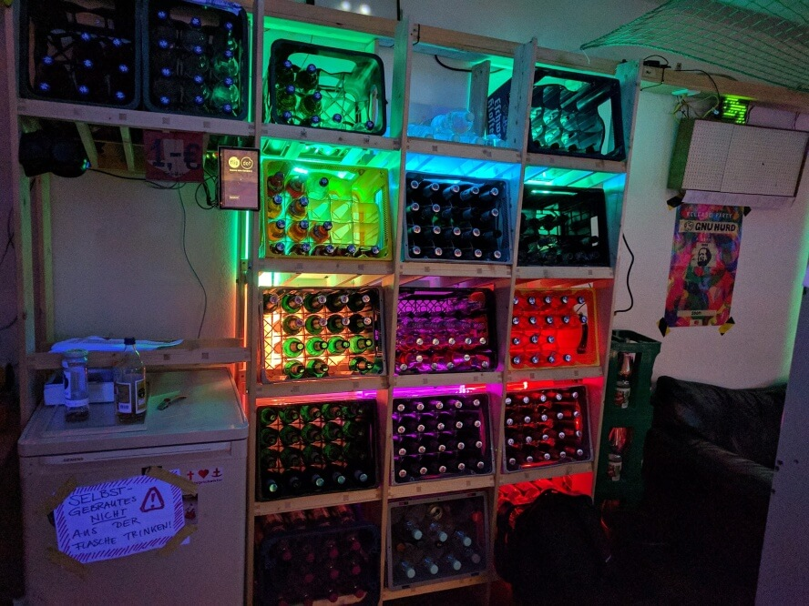

# Blinken-Kisten
The Blinken-Kisten consists of one LED stripe driven by an Arduino Nano with an ATmega168:

* one WS2812B strip with 240 LEDs in GRB format
* one WS2811 strip with 50 LEDs in 3x-RGB format

## Usage
The code can be built and uploaded using [platformio](http://platformio.org/).

## Limitations
There is currently process time as the Arduino has no internet access.
